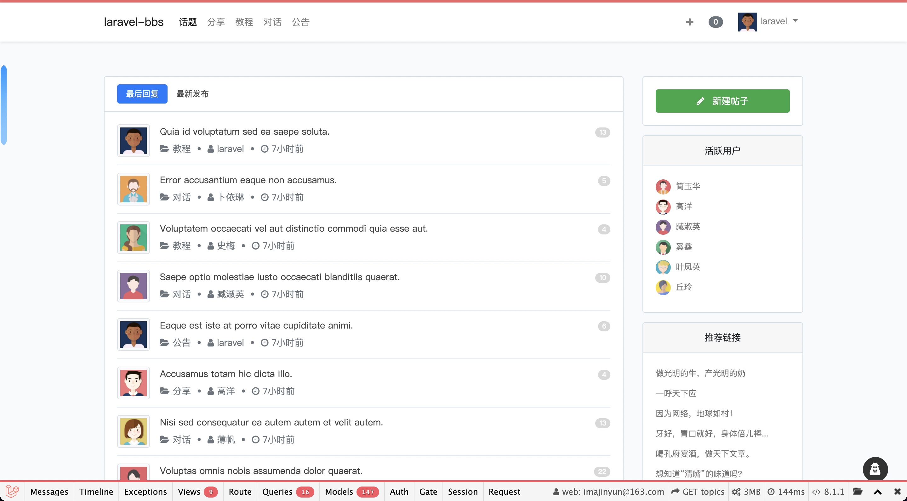

# 🌈 A small application of practice training based on laravel framework

[](https://www.codacy.com/gh/imajinyun/laravel-bbs/dashboard?utm_source=github.com&amp;utm_medium=referral&amp;utm_content=imajinyun/laravel-bbs&amp;utm_campaign=Badge_Grade)
[](https://www.php.net/supported-versions.php)


## Requirements

* PHP >= 8.0.0
* Laravel >= 9.0

## Installation

> This project requires PHP 8+ and Laravel 9.

- visual studio code
- My sql work bench
- docker dektop
- cài đặt Untutu trên VSC để sử dụng WSL

```bash --> warning : use powershell WSL
// Clone source code.
$ git clone https://github.com/hauvutrong/laravel-bbs.git

// Copy .env.development to .env, and fill in the relevant configuration values.
$ cd laravel-bbs && cp .env.development .env

// Install dependencies for application.
$ composer install --ignore-platform-req=ext-pcntl --ignore-platform-req=ext-sodium --ignore-platform-req=ext-sockets --ignore-platform-req=ext-posix

//gen key
php artisan key:generate

// To start Sail.
$ bash ./vendor/laravel/sail/bin/sail up

// Enter laravel-bbs-app container.
$ docker exec -it laravel-bbs-app /bin/bash

// Execute migration command.
## install mysql ddl
$ sudo apt-get install php-mysql
## php-mbstring
$ sudo apt-get install php-mbstring
##php-intl
$ sudo apt-get install php-intl
## Seeders db
$ php artisan migrate --seed

// start laravel (http://127.0.0.1:8000) >>> warning : use powershell teminal 
$ php artisan serve
```

## Screenshots



## command laravel 
--create file dupb autoload
composer dump-autoload
--start laravel
php artisan serve
--clean cache
php artisan cache:clear

## License

## Cài untubu wsl

--update version php
## >>>> Install redis client
Hệ thống con Windows cho Linux và Linux
Redis chưa hỗ trợ chính xác hệ điều hành Windows nên bạn có thể cài đặt WSL (Windows Subsystem for Linux) trên windows để có môi trường Linux.

Để cài đặt Redis trên Linux, hãy chạy:

curl -fsSL https://packages.redis.io/gpg | sudo gpg --dearmor -o /usr/share/keyrings/redis-archive-keyring.gpg

echo "deb [signed-by=/usr/share/keyrings/redis-archive-keyring.gpg] https://packages.redis.io/deb $(lsb_release -cs) main" | sudo tee /etc/apt/sources.list.d/redis.list

sudo apt-get update
sudo apt-get install redis
Sau đó, chạy lệnh này để khởi động Redis:

sudo service redis-server start
## <<<<

## check port ex
netstat -ano | findstr :<PORT>
## Kill port ex
taskkill /PID 0 /F